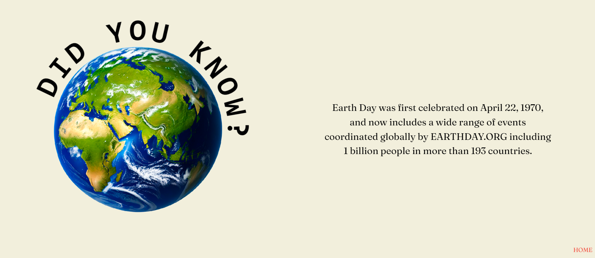

<h1>Earth Day Landing Page</h1>

This project was made as a submission for <a href="https://dev.to/devteam/join-us-for-the-next-frontend-challenge-earth-day-edition-52e4">Frontend Challenge</a> hosted by <a href="https://dev.to/">DEV Community</a>.

<h2>Challenge Prompt:</h2>

Use CSS and JavaScript to make the below starter HTML markup beautiful, interactive, and useful.

Your submission should be more fun and interactive than the HTML we provide, but also be usable and accessible. You should not directly edit the HTML provided, unless it is via JavaScript. We expect style and substance. You may add basic boilerplate, including meta tags etc. for presentation purposes.

<h2>Languages Used</h2>

HTML, CSS, Vanilla JS

<h2>Project Gallery</h2>

